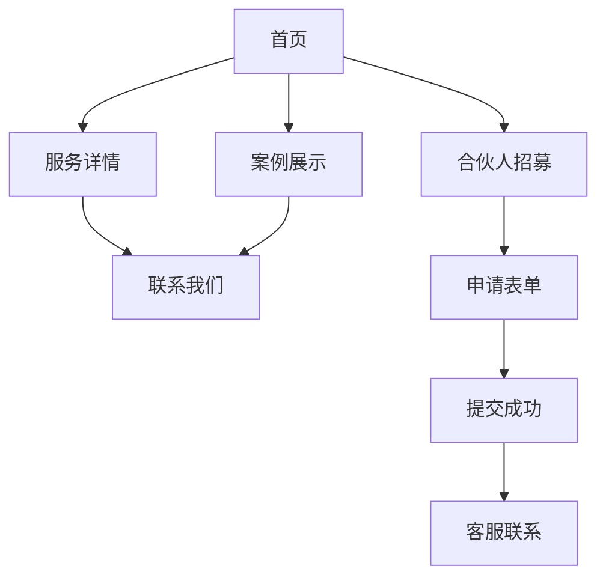

## 1. 产品概述
佛山市好家改造网络科技有限公司专注于家具改色贴膜和门窗隔热防爆膜服务，拥有7年行业经验。本网站旨在展示公司专业服务，招募全国合伙人和代理商，并提供客户资源支持。

目标用户：寻求家居升级改造服务的业主、有意加盟的创业者和代理商。

## 2. 核心功能

### 2.1 用户角色
| 角色 | 注册方式 | 核心权限 |
|------|----------|----------|
| 普通访客 | 无需注册 | 浏览服务介绍、查看案例、提交咨询 |
| 意向合伙人 | 表单注册 | 提交加盟申请、获取联系方式 |

### 2.2 功能模块
网站包含以下主要页面：
1. **首页**：公司介绍、服务展示、案例展示、合伙人招募入口
2. **服务详情页**：家具改色贴膜详情、门窗隔热防爆膜详情
3. **案例展示页**：成功案例图片展示、客户评价
4. **合伙人招募页**：加盟优势、支持政策、申请表单
5. **联系我们页**：联系方式、地图位置、在线咨询

### 2.3 页面详情
| 页面名称 | 模块名称 | 功能描述 |
|----------|----------|----------|
| 首页 | 公司介绍区 | 展示公司7年行业经验、专业团队、服务范围 |
| 首页 | 核心服务区 | 展示家具改色贴膜、门窗隔热防爆膜两大核心服务 |
| 首页 | 成功案例区 | 轮播展示典型改造案例，包含前后对比图 |
| 首页 | 合伙人招募区 | 突出加盟优势，引导至招募页面 |
| 服务详情页 | 家具贴膜详情 | 详细介绍家具改色贴膜的材料、工艺、优势、价格区间 |
| 服务详情页 | 门窗贴膜详情 | 详细介绍隔热防爆膜的功能、效果、适用场景 |
| 案例展示页 | 案例画廊 | 分类展示不同风格的改造案例，支持放大查看 |
| 案例展示页 | 客户评价 | 展示真实客户反馈和满意度 |
| 合伙人招募页 | 加盟优势 | 列出公司提供客户资源、技术支持、培训等优势 |
| 合伙人招募页 | 申请表单 | 收集意向者基本信息：姓名、电话、地区、经验、资金实力 |
| 联系我们页 | 联系信息 | 展示公司地址、电话、微信、工作时间 |
| 联系我们页 | 在线咨询 | 提供在线客服咨询入口 |

## 3. 核心流程
用户访问流程：
1. 访客进入首页了解公司实力和服务内容
2. 浏览服务详情和成功案例建立信任
3. 有意向的用户通过合伙人招募页面提交申请
4. 公司客服主动联系意向合伙人
5. 普通客户可直接电话咨询或在线咨询

## 4. 用户界面设计

### 4.1 设计风格
- **主色调**：深蓝色(#1e3a8a)体现专业可靠，橙色(#f97316)作为强调色突出重要元素
- **按钮样式**：圆角矩形设计，悬停状态有明显颜色变化
- **字体选择**：中文使用思源黑体，英文字体使用Roboto，标题24-32px，正文16px
- **布局风格**：宽屏自适应设计，卡片式内容展示，清晰的视觉层次
- **图标风格**：使用线性图标，简洁现代，与整体设计风格统一

### 4.2 页面设计概述
| 页面名称 | 模块名称 | UI元素 |
|----------|----------|--------|
| 首页 | 导航栏 | 白色背景，logo左侧，右侧菜单项，固定在顶部 |
| 首页 | 主横幅 | 全屏轮播图，展示专业施工场景，叠加公司slogan |
| 首页 | 服务区 | 两个大卡片并列，图标+标题+简介+了解更多按钮 |
| 首页 | 案例区 | 网格布局展示4-6个典型案例，悬停放大效果 |
| 服务详情页 | 头部图 | 服务相关的精美图片，标题文字叠加 |
| 服务详情页 | 内容区 | 图文并茂详细介绍，使用卡片分隔不同特点 |
| 合伙人招募页 | 优势展示 | 数字列表展示6大加盟优势，配有相应图标 |
| 合伙人招募页 | 表单区 | 简洁的表单设计，必填项标注，提交按钮醒目 |

### 4.3 响应式设计
- 采用桌面优先设计，确保在大屏幕上展现最佳效果
- 平板端：768px-1024px，保持核心功能完整展示
- 手机端：小于768px，采用汉堡菜单，内容垂直堆叠
- 所有交互元素在移动端适配触摸操作

### 4.4 视觉要求
- 使用高质量的真实施工照片，突出前后对比效果
- 图片需要专业处理，统一色调和风格
- 避免过度装饰，保持商务专业感
- 重要信息使用醒目的颜色或大小突出