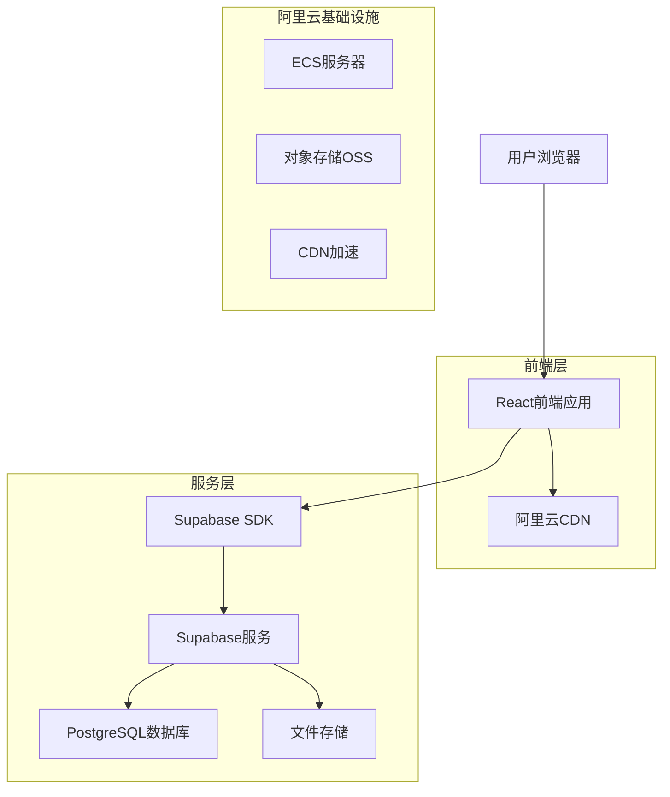
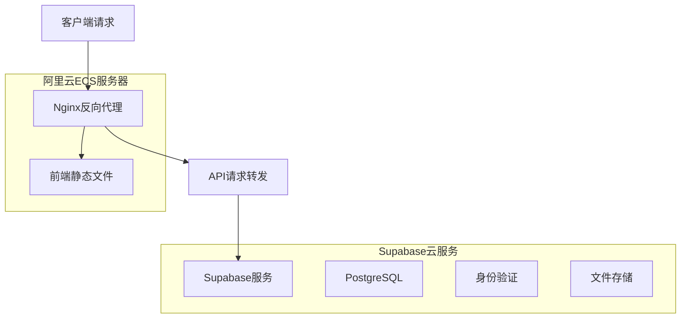
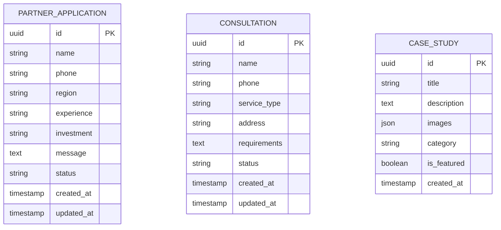

## 1. 架构设计



## 2. 技术描述

- **前端框架**: React@18 + TypeScript + Vite
- **样式框架**: TailwindCSS@3 + 自定义组件库
- **状态管理**: React Context + 自定义Hooks
- **初始化工具**: vite-init
- **后端服务**: Supabase (BaaS)
- **数据库**: PostgreSQL (Supabase提供)
- **文件存储**: Supabase Storage
- **部署平台**: 阿里云ECS + 阿里云CDN

## 3. 路由定义

| 路由 | 用途 |
|-------|---------|
| / | 首页，展示公司介绍、核心服务、成功案例 |
| /services/furniture | 家具改色贴膜服务详情页 |
| /services/window | 门窗隔热防爆膜服务详情页 |
| /cases | 成功案例展示页面 |
| /partner | 合伙人招募页面，包含申请表单 |
| /contact | 联系我们页面，包含联系方式和在线咨询 |

## 4. API定义

### 4.1 合伙人申请API

```
POST /api/partner/applications
```

请求参数：
| 参数名 | 类型 | 必填 | 描述 |
|-----------|-------------|-------------|-------------|
| name | string | 是 | 申请人姓名 |
| phone | string | 是 | 联系电话 |
| region | string | 是 | 意向代理区域 |
| experience | string | 否 | 相关行业经验 |
| investment | string | 是 | 预计投资金额 |
| message | string | 否 | 其他留言信息 |

响应格式：
```json
{
  "success": true,
  "message": "申请提交成功，我们将在24小时内联系您",
  "data": {
    "applicationId": "uuid",
    "status": "pending"
  }
}
```

### 4.2 客户咨询API

```
POST /api/contact/consultations
```

请求参数：
| 参数名 | 类型 | 必填 | 描述 |
|-----------|-------------|-------------|-------------|
| name | string | 是 | 客户姓名 |
| phone | string | 是 | 联系电话 |
| service_type | string | 是 | 服务类型（家具贴膜/门窗贴膜） |
| address | string | 否 | 服务地址 |
| requirements | string | 是 | 具体需求描述 |

## 5. 服务器架构



## 6. 数据模型

### 6.1 数据模型定义



### 6.2 数据定义语言

合伙人申请表 (partner_applications)
```sql
-- 创建表
CREATE TABLE partner_applications (
    id UUID PRIMARY KEY DEFAULT gen_random_uuid(),
    name VARCHAR(50) NOT NULL,
    phone VARCHAR(20) NOT NULL,
    region VARCHAR(100) NOT NULL,
    experience TEXT,
    investment VARCHAR(50) NOT NULL,
    message TEXT,
    status VARCHAR(20) DEFAULT 'pending' CHECK (status IN ('pending', 'contacted', 'approved', 'rejected')),
    created_at TIMESTAMP WITH TIME ZONE DEFAULT NOW(),
    updated_at TIMESTAMP WITH TIME ZONE DEFAULT NOW()
);

-- 创建索引
CREATE INDEX idx_partner_applications_status ON partner_applications(status);
CREATE INDEX idx_partner_applications_created_at ON partner_applications(created_at DESC);

-- 权限设置
GRANT SELECT ON partner_applications TO anon;
GRANT ALL PRIVILEGES ON partner_applications TO authenticated;
```

客户咨询表 (consultations)
```sql
-- 创建表
CREATE TABLE consultations (
    id UUID PRIMARY KEY DEFAULT gen_random_uuid(),
    name VARCHAR(50) NOT NULL,
    phone VARCHAR(20) NOT NULL,
    service_type VARCHAR(50) NOT NULL CHECK (service_type IN ('furniture', 'window')),
    address VARCHAR(200),
    requirements TEXT NOT NULL,
    status VARCHAR(20) DEFAULT 'new' CHECK (status IN ('new', 'contacted', 'quoted', 'completed')),
    created_at TIMESTAMP WITH TIME ZONE DEFAULT NOW(),
    updated_at TIMESTAMP WITH TIME ZONE DEFAULT NOW()
);

-- 创建索引
CREATE INDEX idx_consultations_status ON consultations(status);
CREATE INDEX idx_consultations_service_type ON consultations(service_type);

-- 权限设置
GRANT SELECT ON consultations TO anon;
GRANT ALL PRIVILEGES ON consultations TO authenticated;
```

案例展示表 (case_studies)
```sql
-- 创建表
CREATE TABLE case_studies (
    id UUID PRIMARY KEY DEFAULT gen_random_uuid(),
    title VARCHAR(200) NOT NULL,
    description TEXT,
    images JSONB NOT NULL,
    category VARCHAR(50) NOT NULL CHECK (category IN ('furniture', 'window')),
    is_featured BOOLEAN DEFAULT false,
    created_at TIMESTAMP WITH TIME ZONE DEFAULT NOW(),
    updated_at TIMESTAMP WITH TIME ZONE DEFAULT NOW()
);

-- 创建索引
CREATE INDEX idx_case_studies_category ON case_studies(category);
CREATE INDEX idx_case_studies_featured ON case_studies(is_featured);

-- 权限设置
GRANT SELECT ON case_studies TO anon;
GRANT ALL PRIVILEGES ON case_studies TO authenticated;
```

## 7. 部署配置

### 7.1 阿里云服务器配置
- **实例类型**: ECS计算型 c6.large（2核4G）
- **操作系统**: Ubuntu 20.04 LTS
- **带宽**: 5Mbps
- **存储**: 40GB SSD系统盘 + 100GB数据盘
- **安全组**: 开放80、443、22端口

### 7.2 域名和CDN配置
- **主域名**: 建议使用公司品牌域名
- **CDN加速**: 启用阿里云CDN，缓存静态资源
- **SSL证书**: 使用阿里云免费SSL证书
- **备案**: 完成ICP备案，符合国内法规要求

### 7.3 性能优化
- **图片优化**: 使用WebP格式，自适应尺寸
- **代码分割**: 按路由懒加载组件
- **缓存策略**: 浏览器缓存静态资源30天
- **Gzip压缩**: 启用Nginx Gzip压缩